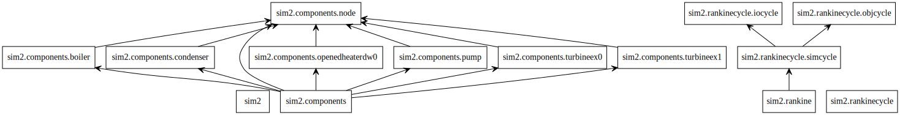

# PyRankine

The two types of general rankine cycle simulator are provided in the PyRankine
 
We wish that PyRankine may be a helpful vehicle for you to understand **Computational Thinking** and improve programming skills.

## The Simulators

### [The Simulator 1](./sim1)

* Using List,Dict and Function 

* CSV Textual Model of the Rankine Cycle Flowsheet 
     
### [The Simulator 2](./sim2)

* Object-oriented programming

* JSON Textual Model of Rankine Cycles Flowsheet 
     
   **The UML Class Diagram: Association**

     
 
## Dependencies：SEUIF97

IAPWS-IF97 high-speed shared library

* https://github.com/PySEE/SEUIF97

Install with pip
```bash
python -m pip install seuif97
```

## The Example Rankine Cycles

The Rankine Cycles used in these general simulators are Example 8.1, 8.2 and 8,5 of **Michael J. Moran. Fundamentals of Engineering Thermodynamics(7th Edition)**. John Wiley & Sons, Inc. 2011

Chapter 8 : Vapour Power Systems 

### The Jupyter Notebooks of Example Rankine Cycles

* [EXAMPLE 8.1: The Ideal Rankine Cycle, P438](http://nbviewer.jupyter.org/github/PySEE/PyRankine/blob/master/notebook/RankineCycle81-82.ipynb)

* [EXAMPLE 8.2: Analyzing a Rankine Cycle with Irreversibilities,  P444](http://nbviewer.jupyter.org/github/PySEE/PyRankine/blob/master/notebook/RankineCycle81-82.ipynb)
  
* [EXAMPLE 8.3: Evaluating Performance of an Ideal Reheat Cycle, P449-451](http://nbviewer.jupyter.org/github/PySEE/PyRankine/blob/master/notebook/RankineCycle83-84.ipynb)

* [EXAMPLE 8.4: Evaluating Performance of a Reheat Cycle with Turbine Irreversibility, P451](http://nbviewer.jupyter.org/github/PySEE/PyRankine/blob/master/notebook/RankineCycle83-84.ipynb)

* [EXAMPLE 8.5: The Regenerative Cycle with Open Feedwater Heater, P456](http://nbviewer.jupyter.org/github/PySEE/PyRankine/blob/master/notebook/RankineCycle85.ipynb)

* [EXAMPLE 8.6: The Reheat–Regenerative Cycle with Two Feedwater Heaters, P460-463](http://nbviewer.jupyter.org/github/PySEE/PyRankine/blob/master/notebook/RankineCycle86.ipynb)

**Start the notebooks**

```bash
>start.bat
```

**Schematic of Example Rankine Cycles**


## Reference

* Computational thinking

  * [wikipedia: Computational thinking]( https://en.wikipedia.org/wiki/Computational_thinking)

  * Jeannette M. Wing. [Computational Thinking Benefits Society]( http://socialissues.cs.toronto.edu/index.html%3Fp=279.html)

* Modeling and Simulation of Engineering Systems

  * R Sinha, Christiaan J. J. Paredis. etc. **Modeling and Simulation Methods for Design of Engineering Systems**. Transactions of the ASME[J]. 2001.03(1):84-91
 
  * MATLAB：Simscape https://cn.mathworks.com/products/simscape.html  

  * OpenMDAO: An open-source MDAO framework written in Python  http://openmdao.org/

  * Modelica
  
    * OpenModelica: An open-source Modelica-based modeling and simulation environment https://openmodelica.org/

      * https://github.com/OpenModelica

    * Michael M.Tiller (作者),  刘俊堂等译. Modelica多领域物理系统建模入门与提高, 航空工业出版社(第1版),2017.05

  * Bond Graph
  
    * Wolfgang Borutzky. Bond Graph Modelling of Engineering Systems：Theory, Applications and Software Support. Springer Science Business Media, LLC 2011

    * 王中双. 键合图理论及其在系统动力学中的应用, 哈尔滨工程大学出版社,2007.08

* ThermoCycle Simulator 

    * Maarten Winter: pyDNA https://github.com/mwoc/pydna

    * ORC Modeling Kit: https://github.com/orcmkit/ORCmKit

    * ACHP: https://github.com/TSTK/ACHP 

    * Rankine Cycle(Steam Turbine) http://cn.mathworks.com/help/physmod/simscape/examples/rankine-cycle-steam-turbine.html

*  Electronic circuit simulator 

   * Jan M. Rabaey: SPICE http://bwrcs.eecs.berkeley.edu/Classes/IcBook/SPICE/

      * SPICE: https://en.wikipedia.org/wiki/SPICE

   * ahkab：a SPICE-like electronic circuit simulator written in Python https://github.com/ahkab/ahkab

   * 杨华中等. 电子电路的计算机辅助分析和设计方法（第二版），清华大学出版社，北京，2008.02

