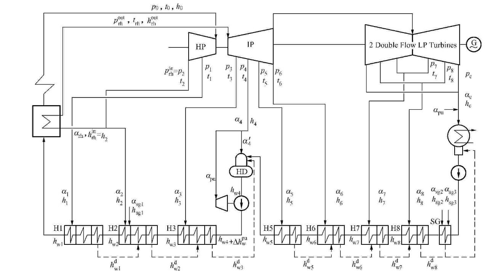

# PyRankine

[](https://zenodo.org/badge/latestdoi/85393590)

The PyRankine is the hybrid steady-state simulator of Rankine Cycle in Python.

In the hybrid simulator, two kind of simulation approachs are provided:

* sequential-modular

* equation-oriented

## Dependencies：SEUIF97

Install

```bash
python -m pip install seuif97
```

## The Example Rankine Cycle

The condensing steam cycle of a supercritical pressure 600MW generating unit is used as the case of example.

The condensing steam cycle has

* three turbines with four exhaust steams

* one sealing, four low pressure feedwater heaters, one open feedwater heater/de-aerator, and three high pressure closed feedwater heaters.



### The Data File of the Example Cycle

The json file is used to representate the example cycle's flowsheet and data

* [The Json file of the example cycle's flowsheet and data](./SimRankine/jsonmodel/N600.json)

## Run

* simulation on 1kg mass
 
```bash
python rankinesim.py
```

* simulation on specified power/mass

```bash
python rankinesim_spec.py
```

## Cite as

Cheng Maohua. (2021, April 4). PyRankine: The Open Source Hybrid Steady-state Simulator of Rankine Cycle in Python (Version V2.0.0). Zenodo. http://doi.org/10.5281/zenodo.4661966

