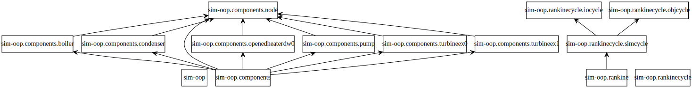

# The Object-oriented programming and JSON Textual Representation of Rankine Cycle Flowsheet

**Run**

```bash
>python rankine.py
```

## Example Rankine Cycles

Michael J. Moran, Howard N. Shapiro, Daisie D. Boettner, Margaret B. Bailey. Fundamentals of Engineering Thermodynamics(7th Edition). John Wiley & Sons, Inc. 2011

Chapter 8 : Vapour Power Systems 

* [EXAMPLE 8.1: Analyzing an Ideal Rankine Cycle, P438](http://nbviewer.jupyter.org/github/PySEE/PyRankine/blob/master/notebook/RankineCycle81-82.ipynb)

* [EXAMPLE 8.2: Analyzing a Rankine Cycle with Irreversibilities, P444](http://nbviewer.jupyter.org/github/PySEE/PyRankine/blob/master/notebook/RankineCycle81-82.ipynb)    
* [EXAMPLE 8.5: The Regenerative Cycle with Open Feedwater Heater, P456](http://nbviewer.jupyter.org/github/PySEE/PyRankine/blob/master/notebook/RankineCycle85.ipynb)

## The UML Class diagram 

### The Class Diagram： Association



### The Class Diagram : Composition


## The Projects 

### Data Files in path `./data`

[The Textual Representation Files of Rankine Cycle](./txtcycle)

* `rankine??.json`

[The Output Files of Rankine Cycle](./output) 

* `rankine??-sm.txt`: the output of Specified Mass Flow

* `rankine??-sp.txt`: the output of the Specified Net Output Power

### Packages

#### [The components Package](./components)

The node  classes in the package

* node

All component classes in the package have these  methods:`__init__`,`state`,
`balance`, `sm_energy`,`export`

* boiler

* conderser

* ...

#### [The rankincycle Package](./rankincycle)

The cycle classes and functions in the package

* iocycle 

* objcycle

* simcycle

## The Methods to check and analysis the mass flow rate

There are dependencies in the mass float rate calculation.

e.g: [EXAMPLE 8.5: The Regenerative Cycle with Open Feedwater Heater, P456](http://nbviewer.jupyter.org/github/PySEE/PyRankine/blob/master/notebook/RankineCycle85.ipynb)

If the Open Feedwater Heater is not calculated, the fraction of extraction steam flow from turbine is not obtained, then the
fraction of the total flow passing through the second-stage turbine is also no value, The turbine work calculation cannot be carried out.

That is to say that the Open Feedwater Heater must be calculated **before** the Turbine.

There is a problem of **equipment calculation order** in the mass float rate of Rankine Cycle

What is the solution? **Hard-coded** Calculation Order? No, It is not the general solution.

In the example codes, we provide one simple general solution:

```python
  def ComponentBalance(self):
        keys = list(self.comps.keys())
        deviceok = False
        
        i = 0  # i: the count of deviceok to avoid endless loop
        while (deviceok == False and i <= self.DevNum):
            
            for curdev in keys:
                try:
                    self.comps[curdev].balance()
                    keys.remove(curdev)
                except:
                    pass
            
            i += 1
            if (keys.count == 0):
                deviceok = True
        
        # for debug: check the failed devices
        if (keys.count >0): 
            print(keys)  
```

## Notes on Python

### 1 Packages
   
   https://docs.python.org/3/tutorial/modules.html#packages

   Packages are a way of structuring Python’s module namespace by using **“dotted module names”**.
   The ` __init__.py  `files are required to make Python treat the **directories** as containing **packages**; 
   this is done to **prevent directories with a common name**, such as string, from unintentionally hiding valid modules that occur later on the module search path. 
   
   In the simplest case, ` __init__.py ` can just be an **empty** file, but it can also execute initialization code for the package or set the ` __all__ ` variable

```bash   
   components/                  components package
      __init__.py               Initialize the components package
      boiler.py
      condenser.py
     ...
```

Users of the package can import **individual modules** from the package, for example:

```python
import components.node
```
An alternative way of importing the submodule is:

```python
from components import node
```
Yet another variation is to import **the desired function or variable** directly:

```python
from components.node import Node
```

### 2 Redirect **stdout** to a file

29.1. sys — System-specific parameters and functions

https://docs.python.org/3/library/sys.html

This module provides access to some variables used or maintained by the **interpreter** and to functions that interact strongly with the interpreter. It is always available.

File objects used by the interpreter for standard input, output and errors:

* sys.stdin ： is used for all interactive input (including calls to input());

* sys.stdout ：is used for the output of print() and expression statements and for the prompts of input();

* sys.stderr：The interpreter’s own prompts and its error messages go to stderr.

These streams are regular **text** files like those returned by the open() function. 

```python
import sys
sys.stdout = open('Redirect2file.txt', 'w')
print('Test: redirect sys.stdout to file')
```

### 3 glob — Unix style pathname pattern expansion

https://docs.python.org/3/library/glob.html

The `glob` module finds all the pathnames matching a specified pattern according to the rules used by the Unix shell, although results are returned in arbitrary order. No tilde(~) expansion is done, but `*`, `?`, and character `ranges` expressed with `[]` will be correctly matched

```python
import glob

json_filesname_str='./data/txtcycle/rankine8[0-9].json'
json_filesname=glob.glob(json_filesname_str)
```

### 4 json — JSON encoder and decoder

Python3: https://docs.python.org/3/library/json.html

***json.loads**

```python
json.loads(s, *, encoding=None, cls=None, object_hook=None, parse_float=None, parse_int=None, parse_constant=None, object_pairs_hook=None, **kw)
```
Deserialize s (a str, bytes or bytearray instance containing a JSON document) to a Python object using this conversion table.

```python
def create_dictcycle_from_jsonfile(filename):
    """ create dict cycle from json file"""
    with open(filename, 'r') as f:
        dictcycle = json.loads(f)
    return dictcycle
```

### 5 object__dict__ & update([other])

**update([other])**

  * Update the dictionary with the key/value pairs from other, overwriting existing keys. Return None.

  * `update()` accepts either another dictionary object or an iterable of key/value pairs (as tuples or other iterables of length two). If keyword arguments are specified, the dictionary is then updated with those key/value pairs: d.update(red=1, blue=2).

**object.\_\_dict__**

*  A dictionary or other mapping object used to store an object’s (writable) attributes.

```python
class Boiler:
  
      def __init__(self,dictDev):
         
         self.__dict__.update(dictDev) 
          
        # self.name = dictDev['name']
        # self.type = dictDev['type']
        # self.inNode = dictDev['inNode']
        # self.outNode = dictDev['outNode']
```   

### 6 `object__iter_` and Iterator 

`boilee.py`

```python

class Boiler:

    def __iter__(self):

        dictobj = {'name': self.name,
                   'inNode': dict(self.iNode),
                   'outNode': dict(self.oNode),
                   'heatAdded(kJ/kg)': self.heatAdded,
                   'QAdded(MW)': self.QAdded
                   }

        for key, value in dictobj.items():
            yield (key, value)
```

`objcycle.py`

```python
def CycleResultDict(self):
    """ convert the objects to dict """ 
        
    compobjs = []
    for key in self.comps:
      compobjs.append(dict(self.comps[key]))

    self.odictcycle["comps"] = compobjs

```

#### 6.1 object.`__iter__`(self)

https://docs.python.org/3/reference/datamodel.html#object.__iter__

This method is called when an **iterator** is required for a container. 

This method should return a new iterator object that can iterate over all the objects in the container. 

For **mappings**, it should iterate over the keys of the container. 

https://docs.python.org/3/library/stdtypes.html#typeiter

#### 6.2 Iterator Types

https://docs.python.org/3/library/stdtypes.html#typeiter

Python supports a concept of iteration over containers. 

This is implemented using two distinct methods; these are used to allow user-defined classes to support iteration. 

One method needs to be defined for container objects to provide iteration support:

**container.__iter__()**

Return an iterator object. The object is required to support the iterator protocol described below. If a container supports different types of iteration, additional methods can be provided to specifically request iterators for those iteration types. (An example of an object supporting multiple forms of iteration would be a tree structure which supports both breadth-first and depth-first traversal.) This method corresponds to the tp_iter slot of the type structure for Python objects in the Python/C API.


The iterator objects themselves are required to support the following two methods, which together form the iterator protocol:

**iterator.__iter__()**
Return the iterator object itself. This is required to allow both containers and iterators to be used with the for and in statements. This method corresponds to the tp_iter slot of the type structure for Python objects in the Python/C API.


**iterator.__next__()**

Return the next item from the container. If there are no further items, raise the StopIteration exception. This method corresponds to the tp_iternext slot of the type structure for Python objects in the Python/C API.


