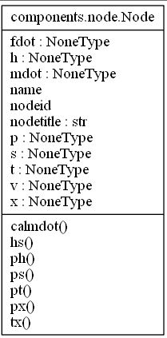
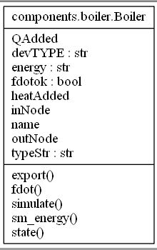
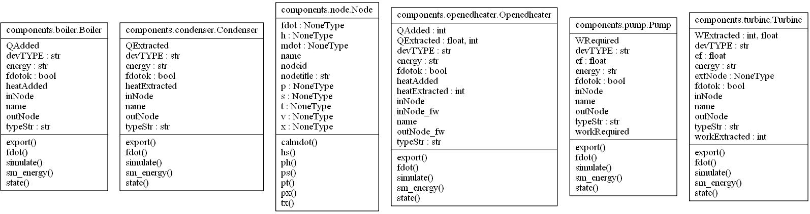
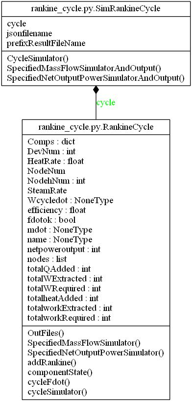
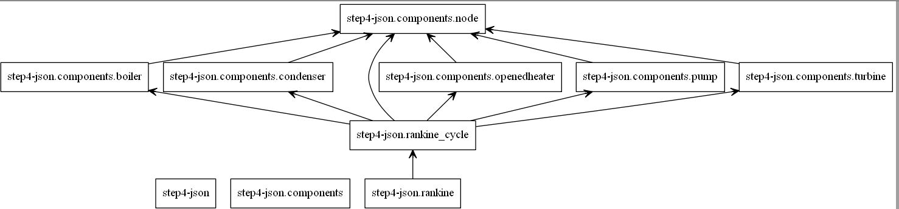

# The UML diagram of the step4-json

## The UML Class diagram of Node

```python
import seuif97 as if97


class Node(object):
  
    nodetitle = ('{:^6} \t {:^30} \t {:^5}\t {:^7}\t {:^7}\t {:^5} \t {:^7}\t {:^7}\t {:^5}\t {:^10}'.format
                 ("NodeID", "Name", "P", "T", "H", "S", "V", "X", "FDOT", "MDOT"))

    def __init__(self, name, nodeid):
        self.name = name
        self.nodeid = nodeid

        self.p = None
        self.t = None
        self.h = None
        self.s = None
        self.v = None
        self.x = None

        self.fdot = None
        self.mdot = None

    def calmdot(self, totalmass):
        self.mdot = totalmass * self.fdot

    def pt(self):
        self.h = if97.pt2h(self.p, self.t)
        self.s = if97.pt2s(self.p, self.t)
        self.v = if97.pt2v(self.p, self.t)
        self.x = if97.pt2x(self.p, self.t)

    def ph(self):
        self.t = if97.ph2t(self.p, self.h)
        self.s = if97.ph2s(self.p, self.h)
        self.v = if97.ph2v(self.p, self.h)
        self.x = if97.ph2x(self.p, self.h)

    def ps(self):
        self.t = if97.ps2t(self.p, self.s)
        self.h = if97.ps2h(self.p, self.s)
        self.v = if97.ps2v(self.p, self.s)
        self.x = if97.ps2x(self.p, self.s)

    def hs(self):
        self.t = if97.hs2t(self.h, self.s)
        self.p = if97.hs2p(self.h, self.s)
        self.v = if97.hs2v(self.h, self.s)
        self.x = if97.hs2x(self.h, self.s)

    def px(self):
        self.t = if97.px2t(self.p, self.x)
        self.h = if97.px2h(self.p, self.x)
        self.s = if97.px2s(self.p, self.x)
        self.v = if97.px2v(self.p, self.x)

    def tx(self):
        self.p = if97.tx2p(self.t, self.x)
        self.h = if97.tx2h(self.t, self.x)
        self.s = if97.tx2s(self.t, self.x)
        self.v = if97.tx2v(self.t, self.x)

    def __str__(self):
        result = ('{:^6d} \t {:<30} \t {:>6.3f}\t {:>7.3f}\t {:>7.2f}\t {:>5.2f} \t {:>7.3f}\t {:>5.3}\t {:>6.4f}\t {:>.2f}'.format
                  (self.nodeid, self.name, self.p, self.t, self.h, self.s, self.v, self.x, self.fdot, self.mdot))
        return result
```



## The UML Class diagram of Boiler

```python
from .node import *


class Boiler(object):

    energy = "heatAdded"
    devTYPE = "BOILER"

    def __init__(self, dictDev):
        """
        Initializes the boiler
        """
        # self.__dict__.update(dictDev)

        self.name = dictDev['name']
        self.inNode = dictDev['inNode']
        self.outNode = dictDev['outNode']
        self.type = dictDev['type']
        # add nodes
        self.nodes = [self.inNode, self.outNode]
        self.fdotok = False

    def state(self, nodes):
        pass

    # add _fdotok_
    def _fdotok_(self, nodes):
        self.fdotok = nodes[self.nodes[0]].fdot != None
        for node in range(1, len(self.nodes)):
            self.fdotok = self.fdotok and (nodes[node].fdot != None)

    def fdot(self, nodes):
        if (self.fdotok == False):
            try:
                # mass blance equation
                if (nodes[self.inNode].fdot != None):
                    nodes[self.outNode].fdot = nodes[self.inNode].fdot
                elif (nodes[self.outNode].fdot != None):
                    nodes[self.inNode].fdot = nodes[self.outNode].fdot

                # modified self.fdotok
                self._fdotok_(nodes)
            except:
                self.fdotok == False

    def simulate(self, nodes):
        self.heatAdded = nodes[self.inNode].fdot * \
            (nodes[self.outNode].h - nodes[self.inNode].h)

    def sm_energy(self, nodes):
        self.QAdded = nodes[self.inNode].mdot * \
            (nodes[self.outNode].h - nodes[self.inNode].h)
        self.QAdded /= (3600.0 * 1000.0)

    def export(self, nodes):
        result = '\n' + self.name
        result += '\n' + Node.title
        result += '\n' + nodes[self.inNode].__str__()
        result += '\n' + nodes[self.outNode].__str__()
        result += '\nheatAdded(kJ/kg) \t%.2f \nQAdded(MW) \t%.2f' % (
            self.heatAdded, self.QAdded)
        return result
```



## The UML Class diagram of Components



## The UML Class diagram of Rankine_cycle



## The UML Association diagram of step4-ison



## Reference

* Unified_Modeling_Language https://en.wikipedia.org/wiki/Unified_Modeling_Language

* UML http://www.uml.org/

* Pyreverse: UML Diagrams for Python https://www.logilab.org/blogentry/6883
