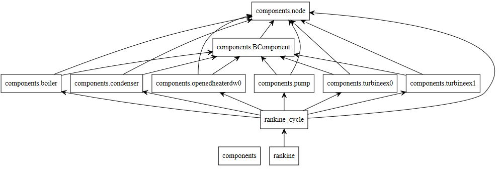
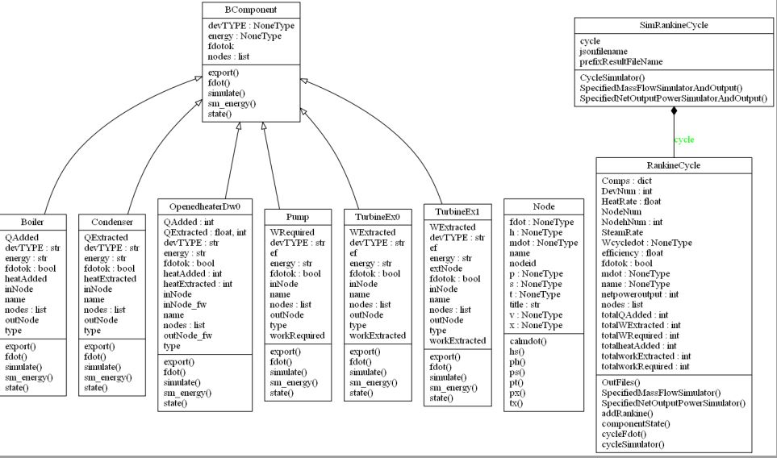

       
# Step5: The Base Class of Components

The General Simulator of Rankine Cycle with the base class of components

* `json` file for the representation of Rankine Cycle Flowsheet and `__init__` device with dict

## Examples of Rankine Cycle
 
Michael J . Moran. Fundamentals of Engineering Thermodynamics(7th Edition). John Wiley & Sons, Inc. 2011

Chapter 8 : Vapour Power Systems Example

* [EXAMPLE 8.1: Analyzing an Ideal Rankine Cycle, P438](http://nbviewer.jupyter.org/github/PySEE/PyRankine/blob/master/notebook/RankineCycle81-82-Step0-1.ipynb)

* [EXAMPLE 8.5: The Regenerative Cycle with Open Feedwater Heater, P456](http://nbviewer.jupyter.org/github/PySEE/PyRankine/blob/master/notebook/RankineCycle85-Step0.ipynb)

## The UML Class diagram 

### The Class Diagram：Directed Association

### The Class Diagram : Inheritanced Dependency, Composition

