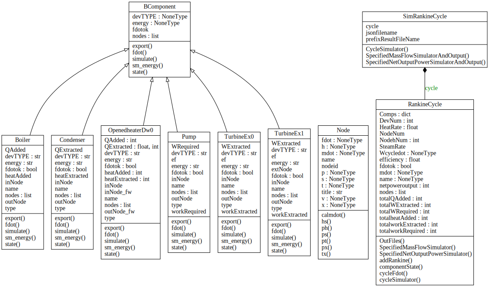

       
# Step5: The Base Class of Components and Textual Representation

Object-oriented programming, general module, the base class

JSON file of Rankine Cycle Flowsheet 

**Run**

```bash
>python rankine.py
```

## Example Rankine Cycles
 
Michael J . Moran. Fundamentals of Engineering Thermodynamics(7th Edition). John Wiley & Sons, Inc. 2011

Chapter 8 : Vapour Power Systems Example

* [EXAMPLE 8.1: Analyzing an Ideal Rankine Cycle, P438](http://nbviewer.jupyter.org/github/PySEE/PyRankine/blob/master/notebook/RankineCycle81-82-Step0.ipynb)

* [EXAMPLE 8.2: Analyzing a Rankine Cycle with Irreversibilities, P444](http://nbviewer.jupyter.org/github/PySEE/PyRankine/blob/master/notebook/RankineCycle81-82-Step0.ipynb)

* [EXAMPLE 8.5: The Regenerative Cycle with Open Feedwater Heater, P456](http://nbviewer.jupyter.org/github/PySEE/PyRankine/blob/master/notebook/RankineCycle85-Step0.ipynb)

## The UML Class diagram 

### The Class Diagram： Association


### The Class Diagram : Inheritance, Composition



## The base class of components

All component classes have the methods:

`__init__`, `state`, `fdot`, `simulate`, `sm_energy`, `export`

 `fdot`: check and analysis get **mass float rate** with mass and energy balance

 * `_fdotok_`: the helper of fdot
 
Two kinds of methods in [the  base class: /components/BComponent.py](./components/BComponent.py)

1. The methods must be implemented by its subclass

```python
def state(self, nodes):
    """ State """
    raise NotImplementedError
```

2. The methods can be inherited and overloaded by its subclass

```python
def export(self, nodes):
    """ export results: name,nodes """
    result = '\n' + self.name
    result += '\n' + Node.title
    for i in self.nodes:
       result +='\n' + nodes[i].__str__()
    return result
```

##  The component class

The component classes are the subclass of the base class

* **Boiler,TurbineEx0,TurbineEx1,OpenedheaterDw0,Pump,Condenser**

For example: [the Boiler class: /components/boiler.py](./components/boiler.py)

```python
from .node import *
from .BComponent import BComponent

class Boiler(BComponent):
      ...    
```

**Python’s super()**

* A subclass for extending a method from its parent class:

The `super()` works with no arguments.

This is convenient that you don't have to `hard-code the name of the base class` into every method that uses its parent methods.
        
```python
def export(self, nodes):
    # result=BComponent.export(self,nodes)
    result=super().export(nodes)
    result += '\nheatAdded(kJ/kg) \t%.2f \nQAdded(MW) \t%.2f' % (
    self.heatAdded, self.QAdded)
    return  result
```
        
```python
def fdot(self, nodes):
    # BComponent.fdot(self,nodes)
    super().fdot(nodes)
```

